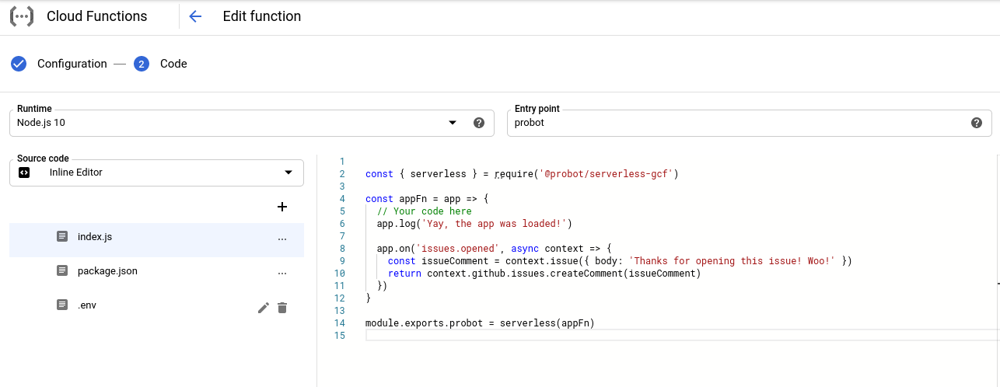

# probot-practice

Trying to make a serverless bot that can be pushed to Firebase.

* https://probot.github.io/docs/serverless-deployment/#create-the-github-app

## GCP

Links:
* https://github.com/angular/github-robot/blob/master/functions/src/index.ts

```bash
npm install @probot/serverless-gcf
```

Create a GCP Cloud Function.

Allow all traffic.

Write your function.



Make sure that `pacakge.json` includes
```json
  "dependencies": {

    "@probot/serverless-gcf": "^0.2.0",
    "probot": "^9.5.3"
  }
```

Make sure `.env` includes: `APP_ID`, `PRIVATE_KEY`, and `WEBHOOK_SECRET`.

Make sure that the entry point is set to 'probot', the `serverless` object.

## AWS

Links:
* https://www.youtube.com/watch?v=7JZLipM8bT0


We will install probot for lambda: `npm install @probot/serverless-lambda`

We will create a `handler.js` file:
```js
// handler.js

const { serverless } = require('@probot/serverless-gcf')
const appFn = require('./')

module.exports.probot = serverless(appFn)
```

We will create a `serverless.yml` file:
```yml
service: sls-response-bot

provider:
    name: aws
    runtime: nodejs8.10
    region: us-east-1

functions:
    router:
        handler: handler.probot

    environment:
        WEBHOOK_SECRET: ***
        APP_ID: ***
        LOG_FORMAT: json

    events:
      - http:
        path: /probot
        method: post
```

IDK what to do now.

