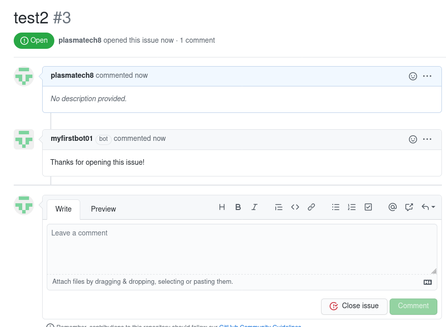

# probot-practice

Following from:
* https://probot.github.io/docs/development/.
* https://andrewlock.net/creating-my-first-github-app-with-probot-part-1-create-probot-app/

## Steps

Create probot app template:
```bash
npx create-probot-app myfirstbot
...
? GitHub user or org name: plasmatech8
? Repository name: myfirstbot
? Which template would you like to use? basic-js
...
```

Install dependencies and start and the app ():
```
cd myfirstbot
npm install
npm run dev
```

Go to http://localhost:3000/probot.

Go to register GitHub App on GitHub.

Make an issue.



## Notes

`.env` must never be pushed to Git.

Smee is being used as a proxy from local machine to GitHub.